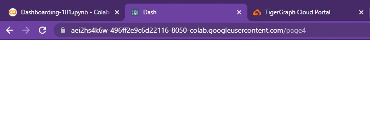
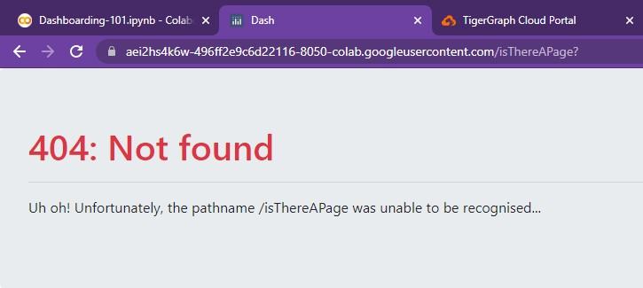
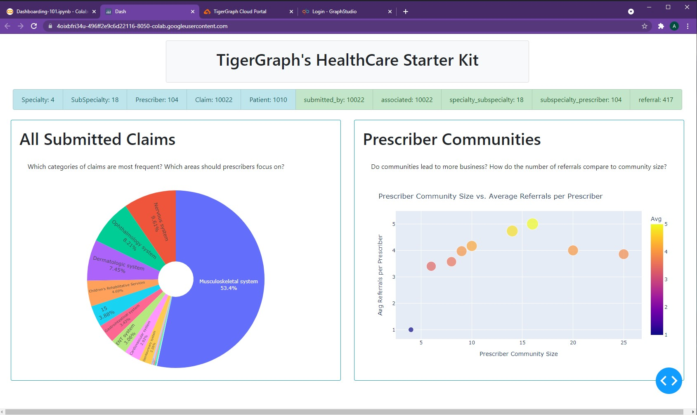
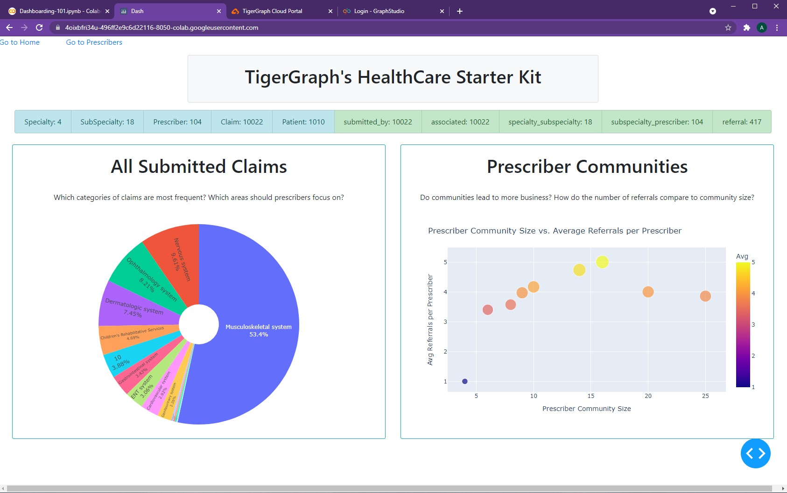
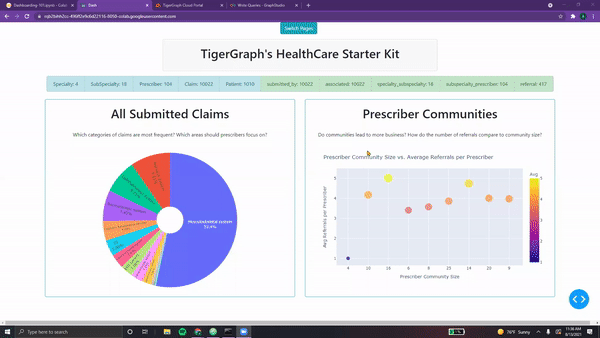
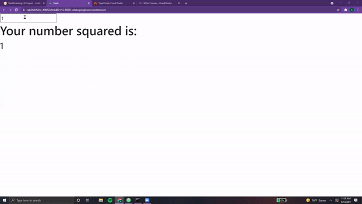
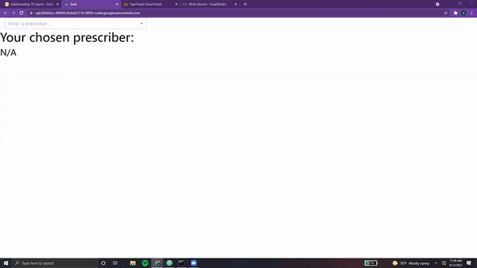

# Multi-Page Layout, Callbacks

## Ch 07 - Multi-Page Layout

??? info "Multi-Page Monster Notes 01"

    ## A Simple Multi-Page App

    The first step in creating **multiple pages for our Dash app** is to separate our content into *multiple distinct variables or elements*. For example, if we wish to create three pages, we can perform this by create <font color='#DD6E0F'>three content variables</font>:

    ```python
    page1_content = html.Div(html.H1("This is Pg. 1!"))
    page2_content = html.Div(html.H1(html.B("This is Pg. 2!")))
    page3_content = html.Div(html.H1(html.I("This is Pg. 3!")))
    ```

    Next, we must change our app layout to reflect this:

    ```python
    app = JupyterDash(__name__)

    app.layout = html.Div([
        dcc.Location(id='url', refresh=False),
        html.Div(id='page-content')
    ])

    @app.callback(dash.dependencies.Output('page-content', 'children'),
                  [dash.dependencies.Input('url', 'pathname')])

    def display_page(pathname):
      if pathname == "/":
        return page1_content
      elif pathname == "/page2":
        return page2_content
      elif pathname == "/page3":
        return page3_content

    app.run_server(mode='external')
    ```

    And now, running the app will only show us the first page!

    <center> {width=800} </center>

    However, entering the proper link will take us to pages 2 and 3.

    <center> {width=800} </center>

    <center> {width=800} </center>

    &nbsp; &nbsp;

    How are we doing this? Well, using a simple callback...

    As defined below the app layout, the <font color='#DD6E0F'>input is simply the pathname of the current page</font>. The output is the page-content, an `html.Div` element that we've defined in our app layout. This is where the **importance of element id's** comes into play! *For any element that will be updated via a callback, an id is needed.*

    ```python
    @app.callback(dash.dependencies.Output('page-content', 'children'),
              [dash.dependencies.Input('url', 'pathname')])
    ```

    Breaking down the function `display_page()`, we simply compare the pathname to several predefined, valid pages. Then, the respective content is returned. This content is stored and displayed in `html.Div(id='page-content')`.

    > NOTE: We will **cover callbacks in the next chapter!** This is merely an <font color='#DD6E0F'>intro used to navigate through pages</font>.

    &nbsp; &nbsp;

    Yet entering any other link will lead to a blank page... uh oh!

    <center> {width=800} </center>

    We need to make sure that the user **doesn't accidentally access any unauthorized or unbuilt pages**. They should only be able to access the extension links that we've provided. In order to secure this,
    we can use <font color='#DD6E0F'>Dash Bootstrap...</font>

    ### Dash Jumbotron

    The Dash Jumbotron is a Bootstrap component that is used to **showcase important messages**. In this case, we'll use it to display a <font color='#DD6E0F'>"404 error message" whenever the user reaches an unauthorized page</font>.

    Adding this jumbotron is quite simple.

    ```python
    app = JupyterDash(__name__, external_stylesheets=[dbc.themes.BOOTSTRAP])

    app.layout = html.Div([
        dcc.Location(id='url', refresh=False),
        html.Div(id='page-content')
    ])

    @app.callback(dash.dependencies.Output('page-content', 'children'),
                  [dash.dependencies.Input('url', 'pathname')])

    def display_page(pathname):
      if pathname == "/":
        return page1_content
      elif pathname == "/page2":
        return page2_content
      elif pathname == "/page3":
        return page3_content

      return dbc.Jumbotron(
            [
                html.H1("404: Not found", className="text-danger"),
                html.Hr(),
                html.P("Uh oh! Unfortunately, the pathname {} was unable to be recognised...".format(pathname)),
            ]
        )

    app.run_server(mode='external')
    ```

    <center> {width=800} </center>

    And just like that, we've put together a **simple multi-page app!**

    In order to modify each page, we can simply change the `html.Div()` element to contain our page's components. To add pages, we can extend our if/else. Yet as of now, users can *only navigate by entering each page's link.*

??? info "Multi-Page Monster Notes 02"

    ## Comprehensive Multi-Page App  

    Let's use our <font color='#DD6E0F'>Healthcare Dashboard</font> and partition it into **two pages**.

    * <font color='#DD6E0F'>General Page</font> - Contains our **title**, **listgroups**, **pie**, and **scatter plot**
    * <font color='#DD6E0F'>Prescriber Page</font> - contains our **table**, **bar chart**, and **network graph**  

    &nbsp; &nbsp;

    ### Global Styles and Variables

    In order to create a better multi-page app, we must first *determine what content is shared across our multiple pages*. We can declare these as **global variables** and have them unchanged upon navigating across pages. This way, our dashboard is <font color='#DD6E0F'>more responsive as there is less to recompute upon each refresh</font>.

    > NOTE: At the moment, we **don't have any shared content**. However, this will <font color='#DD6E0F'>change in future chapters!</font>

    &nbsp; &nbsp;

    ### The Two Pages

    Now, we can create **content variables** for each of the two pages, stored below:

    ```python
    generalPage = html.Div([
                    dbc.Row(titleCard, justify="center"),
                    dbc.Row(statsListGroup, justify="center"),
                    html.Br(),

                    dbc.Row([
                      pieChartCard,
                      scatterChartCard,
                      ],
                      justify="center"
                    ),

                  ])

    prescriberPage = html.Div([
                      dbc.Row([
                        dbc.Col(tableCard),
                        dbc.Col([
                                barCard,
                                networkCard
                                ],
                            )
                          ],
                          justify='center'
                      ),
                  ])
    ```

    As seen, we just *split the two pages* where our original `html.Hr()` used to be!

    Now, we can add in the simple callback to load the correct page.

    ```python
    app = JupyterDash(__name__, external_stylesheets=[dbc.themes.BOOTSTRAP])

    app.layout = html.Div([
        dcc.Location(id='url', refresh=False),
        html.Div(id='page-content')
    ])

    @app.callback(dash.dependencies.Output('page-content', 'children'),
                  [dash.dependencies.Input('url', 'pathname')])

    def display_page(pathname):
      if pathname == "/":
        return generalPage
      elif pathname == "/pre":
        return prescriberPage

      return dbc.Jumbotron(
            [
                html.H1("404: Not found", className="text-danger"),
                html.Hr(),
                html.P("Uh oh! Unfortunately, the pathname {} was unable to be recognised...".format(pathname)),
            ]
        )

    app.run_server(mode='external')
    ```

    &nbsp; &nbsp;

    And here's our dashboard, now with multiple pages!

    <center> {width=800} </center>

    <center> {width=800} </center>

    &nbsp; &nbsp;

    ### Dash Links

    However, having to <font color='#DD6E0F'>manually enter the url for each specific page is **not a good practice**.</font>

    Luckily, Dash provides several methods for navigating through pages. One of the most common
    components used for navigation is the **Dash Link**, which allows users to select which page
    they wish to reach. Let's take a look!

    We simply modify our `app.layout` to include two `dcc.Link()`'s. These are essentially
    *Dash's equivalent of hyperlinks*. No additional callbacks needed, these links function perfectly by themselves!

    ```python
    app.layout = html.Div([
        dcc.Location(id='url', refresh=False),
        dbc.Row([
                 dbc.Col(dcc.Link("Go to Home", href='/'), width=1),
                 dbc.Col(dcc.Link('Go to Prescribers', href='/pre'), width=2),
                ],
                justify="start",
        ),
        html.Div(id='page-content')
    ])
    ```

    <center> {width=800} </center>

    &nbsp; &nbsp;

    By including the `dbc.Row()` with our two links outside of `html.Div(id='page-content')`,
    it remains <font color='#DD6E0F'>static and present in the same location on all pages</font>. However, this may not
    always be needed. For example, we don't need to the *"Go to Prescribers"* hyperlink when
    we are already on that page. To overcome this, we turn to our **layout variables**.

    By adding one `dcc.Link` in each of our pages, we can *remove any unnecessary overlap*.

    ```python
    generalPage = html.Center(html.Div([
                    dbc.Col(dcc.Link("Go to Prescribers", href='/pre'), width=2),
                    dbc.Row(titleCard, justify="center"),
                    dbc.Row(statsListGroup, justify="center"),
                    html.Br(),

                    dbc.Row([
                      pieChartCard,
                      scatterChartCard,
                      ],
                      justify="center"
                    ),

                  ]))

    prescriberPage = html.Center(html.Div([
                      dbc.Col(dcc.Link("Go to Home", href='/'), width=1),
                      prescriberTitleCard,         

                      dbc.Row([
                        dbc.Col(tableCard),
                        dbc.Col([
                                barCard,
                                networkCard
                                ],
                            )
                          ],
                          justify='center'
                      ),
                  ]))
    ```

    <center> {width=800} </center>

    Once again, no callbacks needed! This functions perfectly using the `app.layout` from before.

> NOTE: All code segments from this chapter can be found in this
[Colab Notebook](https://colab.research.google.com/drive/1RRirZeUi_zSBEDS9lDJw1dsxth_V0f-9#scrollTo=SoCB15_Q_XWD).

## Ch 08 - Callbacks

??? info "Callback Notes 01"

    ## A Simple Callback

    Callbacks are <font color='#DD6E0F'>functions that are **called automatically** by Dash everytime a **component's property changes**</font>. They allow for dynamic pages. We had taken a look at a simple callback in the last chapter, but let's *flesh it out further*.

    For reference, here's the code segment from before.

    ```python
    app = JupyterDash(__name__, external_stylesheets=[dbc.themes.BOOTSTRAP])

    app.layout = html.Div([
        dcc.Location(id='url', refresh=False),
        html.Div(id='page-content')
    ])

    @app.callback(dash.dependencies.Output('page-content', 'children'),
                  [dash.dependencies.Input('url', 'pathname')])

    def display_page(pathname):
      if pathname == "/":
        return generalPage
      elif pathname == "/pre":
        return prescriberPage

      return dbc.Jumbotron(
            [
                html.H1("404: Not found", className="text-danger"),
                html.Hr(),
                html.P("Uh oh! Unfortunately, the pathname {} was unable to be recognised...".format(pathname)),
            ]
        )

    app.run_server(mode='external')
    ```

    * As seen, our callback is **introduced with the `@` symbol**
    * It can take a **list of Output** elements as well as a **list of Input** elements
    * In our example, it takes in the input with the ID `'url'`. This component is `dcc.Location(id=url, refresh=False)`, which is a Dash element that <font color='#DD6E0F'>simply keeps track of the url of the current page</font>.
    * In our example, the output element is `html.Div(id='page-content')`, which is just an *empty placeholder*. It's contents are currently empty, but replaced by the callback **upon each url change**

    &nbsp; &nbsp;

    That wasn't too bad to explain! As seen above, callbacks consist of:

    * **Header** - specified by `@app.callback()`, followed immediately by a...
    * **Function** - can be *titled anything*, takes in the <font color='#DD6E0F'>callback input as a parameter</font>.

    Let's take a look at a more complicated input!

    &nbsp; &nbsp;

    ### Introducing dbc.Button()

    Instead of just the url, what if we wanted to add *more aesthetic functionality* directly onto our dash page. One way to do this is with `dbc.Button()` element, which allows for <font color='#DD6E0F'>cleaner clickability</font>.

    This bootstrap component is quite easy to set up.

    ```python
    generalPage = html.Center(html.Div([
                    dbc.Col(dbc.Button(
                          "Switch Pages", id="switch-button",
                          className="mr-2", n_clicks=0, color="info", href="/pre"
                        ),
                        width=2
                    ),
                    dbc.Row(titleCard, justify="center"),
                    dbc.Row(statsListGroup, justify="center"),
                    html.Br(),

                    dbc.Row([
                      pieChartCard,
                      scatterChartCard,
                      ],
                      justify="center"
                    ),

                  ]))

    prescriberPage = html.Center(html.Div([
                      dbc.Col(dbc.Button(
                            "Switch Pages", id="switch-button",
                            className="mr-2", n_clicks=0, color="info", href="/"
                          ),
                          width=2
                      ),
                      prescriberTitleCard,         

                      dbc.Row([
                        dbc.Col(tableCard),
                        dbc.Col([
                                barCard,
                                networkCard
                                ],
                            )
                          ],
                          justify='center'
                      ),
                  ]))
    ```

    <center> {width=800} </center>

    And that's it. <font color='#DD6E0F'>No callbacks needed, at least for now</font>.

    However, the button does have *several other functionalities* beyond serving
    as a glorified hyperlink. It can keep track of the **number of clicks**,
    serve as a method to **download files**, and be customized to **change on click**.

    > NOTE: For more information on Buttons, feel free to check out the following resources:
    [`dbc.Button()`](https://dash-bootstrap-components.opensource.faculty.ai/docs/components/button/)

    &nbsp; &nbsp;

    ### Introducing dcc.Input()

    For more intricate input, we turn to `dcc.Input()`.

    This Dash Core Component supports <font color='#DD6E0F'>several types of text entry</font>, including:

    * **"text"** - regular text, any character goes!
    * **"number"** - numbers and hyphens (for negative) signs only
    * **"password"** - each entered character will be shown as a black dot
    * **"email"** - will ensure that entered text is a valid email format
    * **"tel"** - will ensure that entered text is a valid telephone format

    This element is quite powerful, and can easily be incorporated as shown in this example:

    ```python
    app = JupyterDash(__name__, external_stylesheets=[dbc.themes.BOOTSTRAP])

    app.layout = html.Div([
        dcc.Input(
          id="example-input",
          type="number",
          placeholder="Please enter a number."  
        ),
        html.H1("Your number squared is:"),
        html.Div(id='page-content')
    ])

    @app.callback(dash.dependencies.Output('page-content', 'children'),
                  [dash.dependencies.Input('example-input', 'value')])

    def display_page(value):
      if value is None:
        return html.H3("N/A")
      return html.H3(value*value)


    app.run_server(mode='external')
    ```

    <center> {width=800} </center>

    &nbsp; &nbsp;

    Taking a closer look, we see that the id of the `dcc.Input()` is used in our callback.
    It's `value` attribute is passed in as the <font color='#DD6E0F'>sole parameter of our callback function</font>. Additionally,
    the input type has been specified to be a number.

    Additionally, it's good practice to ensure that <font color='#DD6E0F'>regardless of the input, the callback returns **some**
    **acceptable value**!</font> Even if it's an empty `html.Div()` element, it's good practice to
    make sure that there are no edge cases.

    &nbsp; &nbsp;

    > NOTE: Fore more information on input, feel free to check out the following resources:
    [`dcc.Input`](https://dash.plotly.com/dash-core-components/input)

??? info "Callback Notes 02"

    Currently, the Prescribers page is *static, fixed with the value "pre-78"*. Let's change this so that users
    may able to <font color='#DD6E0F'>search for any valid prescriber within the Graph</font>. First, we need a list of all valid options...

    ## Acceptible Prescribers (Query)

    Using our knowledge from the <font color='#DD6E0F'>**TigerGraph Tundra**</font>, we can write a query that returns all Prescriber IDs.

    ```python
    AllPrescribers = '''USE GRAPH MyGraph
    CREATE QUERY AllPrescribers() FOR GRAPH MyGraph {
      ListAccum<Vertex<Prescriber>> @@allPrescribers;

      start = {Prescriber.*};

      allPres = SELECT p
                  FROM start:p
                  ACCUM @@allPrescribers += p;

      PRINT @@allPrescribers as allPrescribers;
    }
    INSTALL QUERY AllPrescribers'''

    print(conn.gsql(AllPrescribers, options=[]))
    ```

    Running this query gives us the following output,

    <center> {width=800} </center>

    &nbsp; &nbsp;

    Now, we can package it into the appropriate format as follows.

    ```python
    def getPresList():
      pres = conn.runInstalledQuery("AllPrescribers")[0]['allPrescribers']
      return [{'label':x, 'value':x} for x in pres]
    ```

    Awesome! The question remains, <font color='#DD6E0F'>*how do we incorporate this list into our search?*</font>

    Although `dcc.Input()` can support this sort of wordbank in searches, for a simpler implementation
    we will utilize its close relative, `dcc.Dropdown()`. Let's take a closer look...

    &nbsp; &nbsp;

    ## Using dcc.Dropdown()

    Dash's Dropdown allows users to <font color='#DD6E0F'>select values **from a given list of possible options**</font>.

    This component is very powerful, allowing for **multi-value selection**, the ability to **disable certain options**,
    the ability to **clear certain options**, and the
    real-time **updating of options** based on the user's search terms.

    &nbsp; &nbsp;

    For this example, we will be using a basic implementation.

    ```python
    app = JupyterDash(__name__, external_stylesheets=[dbc.themes.BOOTSTRAP])

    presList = getPresList()

    app.layout = html.Div([
        dbc.Col(
            dcc.Dropdown(
              id="example-input",
              placeholder="Enter a prescriber..." ,
              options=presList
            ),
            width=3
        ),
        html.H1("Your chosen prescriber:"),
        html.Div(id='page-content')
    ])

    @app.callback(dash.dependencies.Output('page-content', 'children'),
                  [dash.dependencies.Input('example-input', 'value')])

    def display_page(value):
      if value is None:
        return html.H3("N/A")
      return html.H3(value + " is valid!")


    app.run_server(mode='external')
    ```

    &nbsp; &nbsp;

    Breaking it down, we specify the **id**, **placeholder text**, and **list of options**
    for our Dropdown element. Then, within our callback, we simply display the
    chosen value as well as some accompanying text. Here's the result.

    <center> {width=800} </center>

    &nbsp; &nbsp;

    See, that wasn't so bad! Simple, yet quite powerful.

    > NOTE: For more information on Dropdown, feel free to check out the following resources:
    [`dcc.Dropdown()`](https://dash.plotly.com/dash-core-components/dropdown)

    &nbsp; &nbsp;

    ## Putting it Together

    Let's incorporate this search into our Prescribers Page.

    ```python
    dropdown = dbc.Col(
                        dcc.Dropdown(
                          id="pres-dropdown",
                          placeholder="Enter a prescriber..." ,
                          options=getPresList()
                        ),
                        width=3
                      )

    def prescriberPage(pres):
      prescriberTitleCard, tableCard, barCard, networkCard = getPrescriberInfo(pres)

      page = html.Center(html.Div([
                dbc.Row([
                    dropdown,
                    dbc.Col(dbc.Button(
                          "Switch Pages", id="switch-button",
                          className="mr-2", n_clicks=0, color="info", href="/"
                        ),
                        width=2
                      ),     
                  ],
                  justify='center'
                ),
                prescriberTitleCard,         

                dbc.Row([
                  dbc.Col(tableCard),
                  dbc.Col([
                          barCard,
                          networkCard
                          ],
                      )
                    ],
                    justify='center'
                ),
            ]))

      return page
    ```

    First, we create our dropdown component.

    Next, we create a **parameterized function** that returns the <font color='#DD6E0F'>prescriber page for a given prescriber</font>.
    Within this function, we incorporate the dropdown component (in the first `dbc.Row()`).

    Now, we need to create our app and its callbacks.

    ```python
    app = JupyterDash(__name__, external_stylesheets=[dbc.themes.BOOTSTRAP], suppress_callback_exceptions=True)

    presPage = html.Div(prescriberPage("pre78"), id='pres-content')

    app.layout = html.Div([
        dcc.Location(id='url', refresh=False),
        html.Div(id='page-content')
    ])

    @app.callback(dash.dependencies.Output('page-content', 'children'),
                  [dash.dependencies.Input('url', 'pathname')])

    def display_page(pathname):
      if pathname == "/":
        return generalPage
      elif pathname == "/pre":
        return presPage

      return dbc.Jumbotron(
            [
                html.H1("404: Not found", className="text-danger"),
                html.Hr(),
                html.P("Uh oh! Unfortunately, the pathname {} was unable to be recognised...".format(pathname)),
            ]
        )

    @app.callback(dash.dependencies.Output('pres-content', 'children'),
                  [dash.dependencies.Input('pres-dropdown', 'value')])

    def update_pres(value):
      if value is not None:
        return prescriberPage(value)

      return prescriberPage("pre78") # Our default value


    app.run_server(mode='external')
    ```

    Several changes from before, so let's take a closer look!

    * First, we create a **new variable** to hold the contents of our prescriber page. Named `presPage`, this element
    contains a <font color='#DD6E0F'>unique id and is set to store the default prescriber page</font> value using Prescriber #78.

    * Next, we leave our `app.layout()` and first callback untouched. These allow for navigation.

    * In order to utilize the value of the dropdown, we write a **new callback**. This time, it's input is the
    `pres-dropdown` component. This callback function simply <font color='#DD6E0F'>returns the Prescriber Page with the given prescriber</font>.

    * Note that we've had to add `suppress_callback_exceptions=True` in order to prevent warning pop-ups. This is because when we are on the general page, the dropdown element has not been loaded yet. Although this is not an issue, Dash registers this as a warning!

    > NOTE: **Dashboards can have as many callbacks as desired.** Although each callback can take unlimited inputs, <font color='#DD6E0F'>each
    output can only be utilized once in a callback</font>. For example, one cannot have two callbacks that both output `page-content`.
    This will return an error when loading the Dash app. ***This is why `dash.dependencies.Output()` is simply one
    element, while `dash.dependencies.Input()` is within a list.***

    &nbsp; &nbsp;

    <center> {width=800} </center>

    And with that, we have the first verison of our dynamic dashboard!

> NOTE: All code segments from this chapter can be found in this
[Colab Notebook](https://colab.research.google.com/drive/1RRirZeUi_zSBEDS9lDJw1dsxth_V0f-9#scrollTo=O9mqWSCLCA9C).
